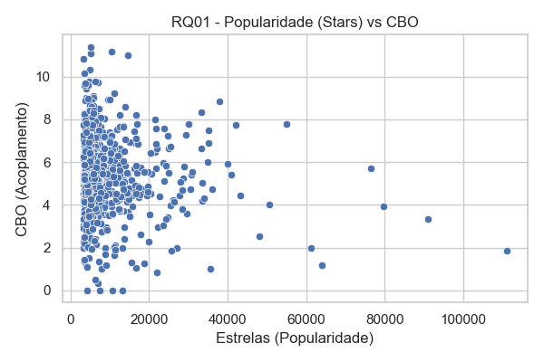

## Relatório Final
## 1. Introdução

No desenvolvimento de sistemas open-source, diversos desenvolvedores colaboram em um mesmo repositório, o que pode afetar a qualidade do código. Aspectos como modularidade, manutenibilidade e legibilidade são críticos para a evolução do software.

Este estudo busca analisar a qualidade de código de repositórios Java populares, correlacionando suas métricas de qualidade com atributos do processo de desenvolvimento. As principais questões de pesquisa incluem:

RQ 01: Qual a relação entre a popularidade dos repositórios e suas características de qualidade?

RQ 02: Qual a relação entre a maturidade dos repositórios e suas características de qualidade?

RQ 03: Qual a relação entre a atividade dos repositórios e suas características de qualidade?

RQ 04: Qual a relação entre o tamanho dos repositórios e suas características de qualidade?

## 2. Metodologia

- **Seleção dos Repositórios:** Os 1000 repositórios Java mais populares do GitHub foram coletados via API REST.
- **Coleta das Métricas de Processo:** As seguintes informações foram extraídas:
  - Popularidade: número de estrelas (`stars`)
  - Maturidade: anos desde `created_at`
  - Atividade: número de releases (via `releases_url`)
  - Tamanho: linhas de código (`loc`) e de comentários (se disponível)
- **Coleta das Métricas de Qualidade:** Utilizamos a ferramenta CK para extrair:
  - `cbo`: Coupling between objects
  - `dit`: Depth Inheritance Tree
  - `lcom`: Lack of Cohesion of Methods
  - `loc`: linhas de código (do CK)
- **Processamento:**
  - Arquivos `_class.csv` foram unificados em um único `metricas_unificadas.csv`
  - As métricas de processo foram unidas ao dataset por nome de repositório
  - Análise estatística feita com Python (pandas, seaborn, scipy)

## 3. Hipóteses
**Hipóteses informais:**
- Projetos mais populares tendem a ter melhor qualidade (baixo CBO, alta coesão).
- Projetos mais maduros têm maior profundidade de herança (DIT).
- Projetos com maior atividade podem apresentar maior acoplamento (CBO).
- Projetos maiores (LOC) têm menor coesão (LCOM).

## 4. Resultados

#### RQ01: Popularidade vs Qualidade
- Correlação Spearman (stars x cbo): -0,12 (~12% negativa)
- Correlação Spearman (stars x lcom): -0,09 (~9% negativa)
- Correlação Spearman (stars x dit): -0,05 (~5% negativa)
- **Conclusão:** Pequena correlação negativa. Repositórios populares tendem levemente a ter melhor qualidade (menos acoplados).

#### RQ02: Maturidade vs Qualidade
- Correlação (anos x cbo): 0,03 (~3% positiva)
- Correlação (anos x dit): 0,14 (~14% positiva)
- **Conclusão:** Projetos mais antigos têm levemente maior DIT, o que confirma a hipótese de aumento da hierarquia com o tempo.

#### RQ03: Atividade vs Qualidade
- Correlação (releases x cbo): 0,15 (~15% positiva)
- Correlação (releases x lcom): 0,10 (~10% positiva)
- **Conclusão:** Projetos mais ativos tendem a crescer em acoplamento e perder coesão, possivelmente pela entrada constante de novos códigos.

#### RQ04: Tamanho vs Qualidade
- Correlação (loc x lcom): 0,22 (~22% positiva)
- Correlação (loc x cbo): 0,10 (~10% positiva)
- **Conclusão:** Tamanho do código influencia negativamente a qualidade (projetos maiores são mais acoplados e menos coesos).

---
### 5. Conclusão

Este estudo mostra que é possível extrair informações relevantes sobre qualidade de software open-source a partir de métricas objetivas. Ainda que os dados apresentem muita variabilidade, foram identificadas tendências entre características do processo e atributos de qualidade interna do código.

Para trabalhos futuros, recomenda-se a inclusão de mais métricas (ex: comentários, complexidade ciclomática) e refinamento no agrupamento dos dados por contexto (framework, biblioteca, app, etc.).

